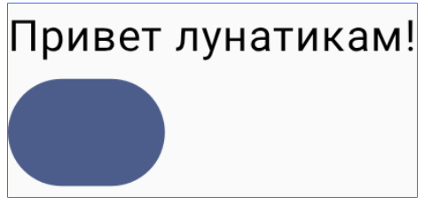

# Состояния

## Добавим кнопку и сделаем так, чтобы нажав её мы изменили текст в текстовом поле

```kotlin
@Composable
fun MainScreen() {
    Column() {
        Text(
            text = "Привет лунатикам!",
        )
        Button({}) { }
    }
}
```



Кнопка имеет параметры:
```kotlin
@Composable
@ComposableInferredTarget
public fun Button(
    onClick: () -> Unit,
    modifier: Modifier = Modifier,
    enabled: Boolean = true,
    shape: Shape = ButtonDefaults.shape,
    colors: ButtonColors = ButtonDefaults.buttonColors(),
    elevation: ButtonElevation? = ButtonDefaults.buttonElevation(),
    border: BorderStroke? = null,
    contentPadding: PaddingValues = ButtonDefaults.ContentPadding,
    interactionSource: MutableInteractionSource? = null,
    // Обратите внимание на RowScope !!! content будет помещен в Row !!!
    content: @Composable (RowScope.() -> Unit)
): Unit
```

Давайте с ней немного поиграем:
Замените `Button({}) { }` на следующий код:

```kotlin
        val brush = Brush.linearGradient(listOf<Color>(Color.Red, Color.White))
        val shape = RoundedCornerShape(4.dp, 16.dp, 32.dp, 48.dp)
        Button(
            {},
            shape = shape,
            colors = ButtonColors(
                containerColor = Color.Red,
                contentColor = Color.White,
                disabledContainerColor = Color.LightGray,
                disabledContentColor = Color.DarkGray
            ),
            elevation = ButtonDefaults.buttonElevation(
                defaultElevation = 2.dp,
                pressedElevation = -(2).dp,
                focusedElevation = 2.dp,
                hoveredElevation = 1.dp,
                disabledElevation = 1.dp
            ),
            border = BorderStroke(width = 2.dp, brush)
        ) {
            Text("Жми!")
            Spacer(Modifier.width(4.dp))
            Box(Modifier.clip(shape).size(16.dp).background(brush))
        }
```
Пока кнопка ничего не делает.
А строка текста задана константой "Привет лунатикам!"

Вынесем текст в переменную и будем менять её значение кнопкой: (чтобы запись занимала меньше места я чуть упрощу код)
```kotlin
@Composable
fun MainScreen() {
    var text = "Привет лунатикам!"
    Column() {
        Text(
            text = "Привет лунатикам!",
        )
        Button({text = "Вставай!"}) { }
    }
}
```
Как легко убедиться, этот код не работает. Почему?
Давайте проследим, что происходит в функции, для этого расставим точки логирования

```kotlin
@Composable
fun MainScreen() {
    Log.i(":))" , "Начало")
    var text = "Привет лунатикам!"
    Log.i(":))" , "После text")
    Column() {
        Log.i(":))" , "Рисуем Text")
        Text(
            text = "Привет лунатикам!",
        )
        Button({
            text = "Вставай!"
            Log.i(":))" , "Нажата кнопка")
        }) { }
    }
    Log.i(":))" , "Конец")
}
```

Запустим код в эмуляторе, откроем окно Logcat, введём строку тега сообщений `:))` в строку поиска 
Мы увидим:
```
2026-03-03 04:41:05.585 16408-16408 :))                     kz.misal.alc                         I  Начало
2026-03-03 04:41:05.585 16408-16408 :))                     kz.misal.alc                         I  После text
2026-03-03 04:41:05.586 16408-16408 :))                     kz.misal.alc                         I  Рисуем Text
2026-03-03 04:41:05.591 16408-16408 :))                     kz.misal.alc                         I  Конец
```

Очистим экран сообщений и нажмём кнопку в эмуляторе. И...
```
2026-03-03 04:43:11.260 16408-16408 :))                     kz.misal.alc                         I  Нажата кнопка
```
Мы видим что наш экран не перерисовался! 

Заставим его это сделать!   

Передадим ему сигнал о том, что ему следует выполнить рекомпозицию!

Для этого подпишем его на изменение состояния переменной text.  

Тип int это делать не умеет, но умеет MutableIntState!

Измени код и посмотри в LogCat, как он работает

```kotlin
@Composable
fun MainScreen() {
    Log.i(":))" , "Начало")

    val text = remember { mutableStateOf("Привет лунатикам!") }

    Log.i(":))" , "После text")
    Column() {
        Log.i(":))" , "Рисуем Text ${text.value}")
        Text(
            text = text.value,
        )
        Button({
            text.value = "Вставай!"
            Log.i(":))" , "Нажата кнопка")
        }) { }
    }
    Log.i(":))" , "Конец")
}
```
Мы добавили состояние композиции. Оно отслеживается и при изменении композиция выполняем перекомпоновку.


> Последние штрихи, State - это как бы оболочка над значением, и его приходится получать используя `.value`
> Можно использовать оператор делегирования `by` и тогда код несколько упроститься:

```kotlin
@Composable
fun MainScreen() {
    var text by remember { mutableStateOf("Привет лунатикам!") }
    Column() {
        Text(text = text)
        Button({ text = "Вставай!" }) {
            Text ("Жми")
        }
    }
}
```

### Добавим поле ввода

Ему потребуется своё состояние

```kotlin
@Composable
fun MainScreen() {
    var text by remember { mutableStateOf("Привет лунатикам!") }
    var inputText by remember { mutableStateOf("") }
    Column() {
        OutlinedTextField(
            inputText,
            {newString -> inputText=newString}
        )
        Text(text = text)
        Button({ text = "Вставай!" }) {
            Text ("Жми")
        }
    }
}
```

Всё работает. 

Давайте сделаем так, чтобы по нажатию кнопки текст переносился в текстовое поле, а поле ввода - очищалось.

```kotlin
@Composable
fun MainScreen() {
    var text by remember { mutableStateOf("Привет лунатикам!") }
    var inputText by remember { mutableStateOf("") }
    Column() {
        OutlinedTextField(
            inputText,
            {newString -> inputText=newString}
        )
        Text(text = text)
        Button({ 
            text = inputText
            inputText = ""
        }) {
            Text ("Жми")
        }
    }
}
```

Последние штрихи,
- растянем поле ввода на весь экран (для этого нужно чтобы Column занял всю ширину экрана) и
- поместим текстовое поле в центре колонки,
- кнопку поместим внизу экрана.
```kotlin
@Composable
fun MainScreen() {
    var text by remember { mutableStateOf("Привет лунатикам!") }
    var inputText by remember { mutableStateOf("") }
    Box(Modifier.fillMaxSize()){
        Column(Modifier.fillMaxWidth(), horizontalAlignment = Alignment.CenterHorizontally) {
            OutlinedTextField(
                inputText,
                {newString -> inputText=newString},
                modifier = Modifier.fillMaxWidth().padding(start = 16.dp, end = 16.dp)
            )
            Text(text = text)
        }
        Button({
            text = inputText
            inputText = ""
        }, modifier = Modifier.align(Alignment.BottomEnd).padding(bottom = 32.dp, end = 16.dp)) {
            Text ("Жми")
        }
    }
}
```

Доработайте дизайн странички по своему вкусу.

